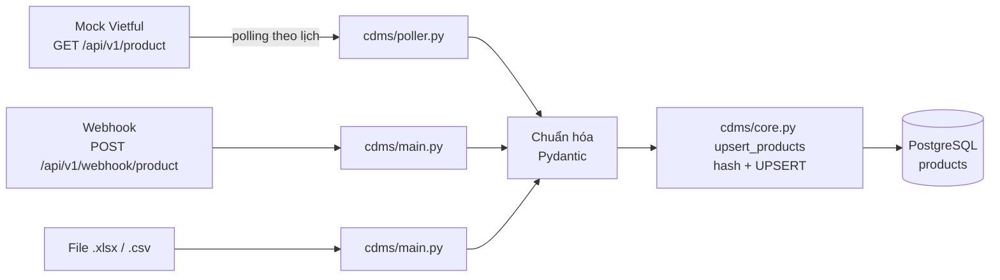
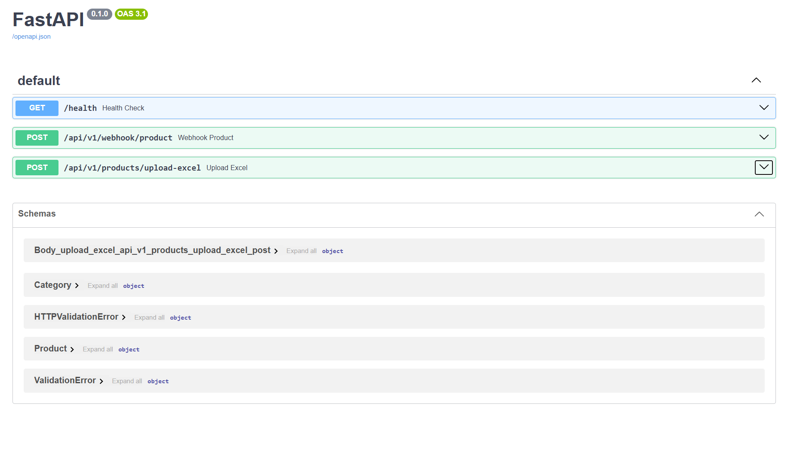

# Change Data Management Service (Prototype)

Đây là bản prototype mô tả hệ thống CDMS . Service nhận dữ liệu sản phẩm từ các nguồn nhất định (polling theo lịch query data, qua webhook, upload Excel/CSV) và **chỉ lưu dữ liệu mới hoặc đã thay đổi** vào Database (PostgreSQL), không lưu trùng.

## Basic Workflow



## Tech stack

FastAPI, SQLAlchemy, PostgreSQL, APScheduler, pandas, Docker Compose.

## Quick start

```
cp .env.example .env
docker compose up --build
curl localhost:8000/health
```

Mở trang `http://localhost:8000/docs` để thực hiện test api.


## Docs

| File | Content |
| --- | --- |
| [docs/design.md](docs/design.md) | Kiến trúc, schema, hash + UPSERT, API, cách xử lý lỗi |
| [docs/testing.md](docs/testing.md) | Cách test và kết quả spike/chaos test |
| [docs/report.md](docs/report.md) | Quan điểm của em về challenge này |

## Project structure

```
interview-challenge-ksynerx/
├── docker-compose.yml       
├── .env.example             # cấu hình mẫu; .env thật được gitignore
├── .gitignore
├── README.md
├── vietful_mock/           # service giả lập Vietful
│   └── Dockerfile          
│   └── main.py             # FastAPI app
│   └── mock_vietful.py     # dữ liệu product sinh bằng Faker, hỗ trợ ?perturb=true
│   └── requirements.txt    # package dependencies
├── cdms/                   # service chính (CDMS)
│   └── Dockerfile          
│   └── config.py           # load config vars
│   └── main.py             # FastAPI app, 3 endpoint, exception handler
│   └── poller.py           # job APScheduler gọi Vietful theo chu kỳ
│   └── core.py             # core xử lý
│   └── db.py               # engine SQLAlchemy, init_db(), check_db()
│   └── schemas.py          # model Pydantic
│   └── utils.py            # map header Excel -> tên field, parse 1 dòng
│   └── schema.sql          # DDL bảng products, chạy idempotent lúc startup
│   └── requirements.txt    # package dependencies
├── tests/                  
└── docs/
```
