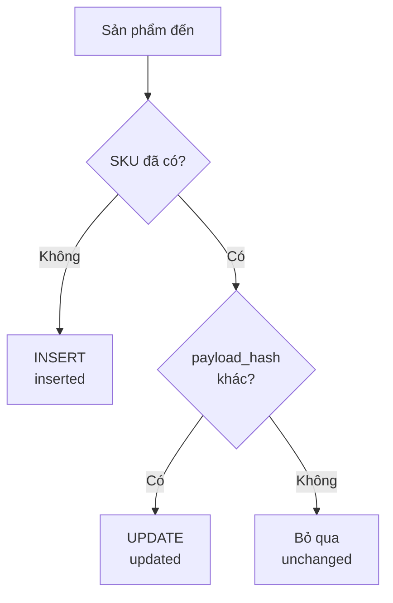

# Design

## 1. Architecture

Sẽ có 3 cách get và parse data khác sau. Sau đó tất cả gọi chung `code.upsert_products()`, nên logic chống trùng chỉ nằm ở một chỗ.

- **Mock Vietful**: GET `/api/v1/product` và GET `/api/v1/product/{sku}`, sinh dữ liệu bằng `Faker` và có thể thay đổi ngẫu nhiên một số trường để giả lập dữ liệu thật thay đổi.

- **CDMS**: một service FastAPI chạy cùng scheduler nền (APScheduler).

- **PostgreSQL 16**: bảng products, có healthcheck pg_isready trong Docker Compose.

- **Database schema** : table `products` được ánh xạ từ source Vietful, có thêm cột `payload_hash`, `created_at`, `updated_at`, dùng hash ở đây để kiểm tra sự trùng lăp dự liệu.

## 2. Core handle chính (hash and upsert)

- `compute_hash()` băm SHA-256 của all trường trừ `productId`. Dữ liệu đẩy lên từ 3 nguồn sẽ được chuẩn hóa rồi sau đó tiến hành hash.

- Sau đó thì chỉ cần compare các mã hash thì sẽ xác định được là product có trùng lặp hay không.

- Luồng cơ bản xác định new products dựa trên mã hash



- Toàn bộ việc so sánh nằm trong một câu lệnh của PostgreSQL nên không có lỗ hổng "kiểm tra rồi mới ghi" giữa nhiều request chạy song song.

```sql
INSERT INTO products (...) VALUES (...)
ON CONFLICT (sku) DO UPDATE SET ... , payload_hash = EXCLUDED.payload_hash
WHERE products.payload_hash IS DISTINCT FROM EXCLUDED.payload_hash
RETURNING (xmax = 0) AS inserted
```

## 3. API

| Method | Endpoint | Mô tả |
| --- | --- | --- |
| GET | `/health` | Kiểm tra service và kết nối DB (200 hoặc 503) |
| GET | `/api/v1/product` | Mock Vietful: danh sách sản phẩm |
| GET | `/api/v1/product/{sku}` | Mock Vietful: một sản phẩm |
| POST | `/api/v1/webhook/product` | Nhận 1 object hoặc 1 mảng sản phẩm |
| POST | `/api/v1/products/upload-excel` | Upload `.xlsx` hoặc `.csv` |

## 4. Error handling

Core handle ở đây là UPSERT **idempotent**: gửi lại cùng một dữ liệu bao nhiêu lần cũng không tạo trùng, nên có thể retry mà không cần phải sợ là duplicate data.

| Tình huống | Cách xử lý | Vị trí |
| --- | --- | --- |
| Vietful sập hoặc chậm | Mỗi lượt poll chỉ gọi một lần (timeout 10 giây). Lỗi thì ghi log và chờ lượt poll kế tiếp, scheduler không bị chết | `app/poller.py` |
| Hai lần poll chồng nhau | `max_instances=1`, `coalesce=True` | `app/poller.py` |
| DB sập khi app đang chạy | `pool_pre_ping` tự nối lại. Webhook và upload trả `503` kèm `Retry-After` | `app/db.py`, `app/main.py` |
| DB chưa sẵn sàng lúc khởi động | Compose chỉ chạy CDMS khi DB `healthy`. Nếu `init_db()` vẫn lỗi (ví dụ sau khi cả máy reboot) thì process thoát và `restart: unless-stopped` dựng lại container | `docker-compose.yml` |
| CDMS bị crash | `restart: unless-stopped`. Webhook xử lý đồng bộ nên không có dữ liệu "đã nhận nhưng chưa lưu". Batch nằm trong một transaction nên crash giữa chừng sẽ rollback sạch, gửi lại là xong | `docker-compose.yml`, `app/cdc.py` |
| Máy host sập hoặc khởi động lại | Docker tự chạy khi boot, restart policy dựng lại container, volume `pgdata` giữ dữ liệu | `docker-compose.yml` |
| Một dòng dữ liệu lỗi | Savepoint riêng cho mỗi dòng, dòng lỗi được ghi vào `errors` | `app/cdc.py` |
| File Excel hỏng | Trả `400` và danh sách lỗi theo từng dòng | `app/routers/excel.py` |
